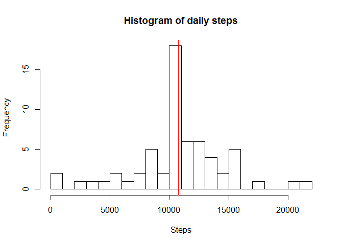

# Reproducible Research: Peer Assessment 1


## Loading and preprocessing the data

Unzip, read and parse dates.


```r
unzip("activity.zip")
data <- read.csv("activity.csv")
data$date <- as.Date(data$date, "%Y-%m-%d")
str(data)
```

```
## 'data.frame':	17568 obs. of  3 variables:
##  $ steps   : int  NA NA NA NA NA NA NA NA NA NA ...
##  $ date    : Date, format: "2012-10-01" "2012-10-01" ...
##  $ interval: int  0 5 10 15 20 25 30 35 40 45 ...
```

```r
summary(data)
```

```
##      steps             date               interval     
##  Min.   :  0.00   Min.   :2012-10-01   Min.   :   0.0  
##  1st Qu.:  0.00   1st Qu.:2012-10-16   1st Qu.: 588.8  
##  Median :  0.00   Median :2012-10-31   Median :1177.5  
##  Mean   : 37.38   Mean   :2012-10-31   Mean   :1177.5  
##  3rd Qu.: 12.00   3rd Qu.:2012-11-15   3rd Qu.:1766.2  
##  Max.   :806.00   Max.   :2012-11-30   Max.   :2355.0  
##  NA's   :2304
```


## What is mean total number of steps taken per day?


```r
library(dplyr)
```

```
## 
## Attaching package: 'dplyr'
## 
## The following objects are masked from 'package:stats':
## 
##     filter, lag
## 
## The following objects are masked from 'package:base':
## 
##     intersect, setdiff, setequal, union
```

```r
daily_steps <- data %>%
    group_by(date) %>%
    summarize(steps = sum(steps))
daily_steps <- daily_steps[!is.na(daily_steps$steps)]
ds_mean <- mean(daily_steps$steps, na.rm = TRUE)
ds_median <- median(daily_steps$steps, na.rm = TRUE)
hist(daily_steps$steps, breaks = 20,
     main = "Histogram of daily steps",
     xlab = "Steps")
abline(v = ds_mean, col = 1)
abline(v = ds_median, col = 2)
```

 

```r
data.frame(mean = ds_mean, median = ds_median)
```

```
##       mean median
## 1 10766.19  10765
```

Mean of the steps taken daily is 10766.19
and the median is 10765.
They are very close each other, hence their vertical lines
in the plot above overlap.


## What is the average daily activity pattern?


```r
avg_steps <- data %>%
    group_by(interval) %>%
    summarize(steps = mean(steps, na.rm = TRUE))
with(avg_steps,
     plot(interval, steps, type = "l",
          main = "Average steps taken during a time of the day",
          xlab = "5-minute interval"))
```

 

```r
busiest <- avg_steps[avg_steps$steps == max(avg_steps$steps),]$interval
```

The busiest interval of the day is 835, i.e.
5 minutes after 8:35.


## Imputing missing values

From the summary above, we can see the dataset has
2304 missing values (`NA`s).


```r
sum(is.na(avg_steps$steps))
```

```
## [1] 0
```

From the data structure (`str`) above we know that interval column does not contain
any `NA`s and that for each interval there is some data, therefore
we will fill mising values for an interval as a mean over that interval.


```r
imputed <- merge(data, avg_steps, by = c("interval"),
                 all = FALSE, all.x = TRUE, all.y = FALSE)
imputed$steps <- ifelse(is.na(imputed$steps.x), imputed$steps.y, imputed$steps.x)
imputed <- imputed[, c("steps", "date", "interval")]
summary(imputed)
```

```
##      steps             date               interval     
##  Min.   :  0.00   Min.   :2012-10-01   Min.   :   0.0  
##  1st Qu.:  0.00   1st Qu.:2012-10-16   1st Qu.: 588.8  
##  Median :  0.00   Median :2012-10-31   Median :1177.5  
##  Mean   : 37.38   Mean   :2012-10-31   Mean   :1177.5  
##  3rd Qu.: 27.00   3rd Qu.:2012-11-15   3rd Qu.:1766.2  
##  Max.   :806.00   Max.   :2012-11-30   Max.   :2355.0
```


```r
library(dplyr)
daily_steps <- imputed %>%
    group_by(date) %>%
    summarize(steps = sum(steps))
ds_mean <- mean(daily_steps$steps)
ds_median <- median(daily_steps$steps)
hist(daily_steps$steps, breaks = 20,
     main = "Histogram of daily steps",
     xlab = "Steps")
abline(v = ds_mean, col = 1)
abline(v = ds_median, col = 2)
```

 

```r
data.frame(mean = ds_mean, median = ds_median)
```

```
##       mean   median
## 1 10766.19 10766.19
```

After imputing the missing values by the method above,
the peak of steps per day got higher. The mean and the median
essentially did not change.


## Are there differences in activity patterns between weekdays and weekends?


```r
library(lubridate)
weekday <- wday(imputed$date)
weekday <- ifelse(weekday == 1 | weekday == 7, 1, 2)
imputed$weekday <- factor(weekday, c(1, 2), c("weekend", "weekday"))
```

```r
library(ggplot2)
avg_steps <- imputed %>%
    group_by(weekday, interval) %>%
    summarize(steps = mean(steps, na.rm = TRUE))
qplot(data = avg_steps,
      interval, steps,
      facets = weekday ~ .,
      geom = "line",
      main = "Average steps taken during a time of the day",
      xlab = "5-minute interval")
```

 

Weekday and weekend pattern look pretty similar. During weekends, the subject walks
throughout the whole day, whereas during weekdays, there is a sharp peak
at about 9 am.
